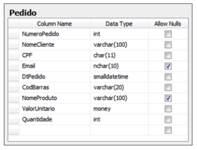

<h1>NewTab Academy</h1>
<h2>Projeto Individual PHP</h2>

<h3>Escopo do projeto individual (PHP)</h3>

Relembrando: como falamos, é por meio do desenvolvimento dos projetos que vamos reforçar os conteúdos que está estudando e demonstrar sua capacidade de execução com os conhecimentos adquiridos. E é também com eles que vamos avaliar juntos sua evolução em cada tecnologia.

A seguir você pode conferir o projeto individual obrigatório que deverá ser desenvolvido neste módulo. Você deve focar em desenvolvê-lo agora.

Não se esqueça que o direcionamento aqui na plataforma é apenas uma parte de todos os recursos que estão disponíveis para que você evolua no aprendizado e na carreira, você deve aproveitar o apoio de facilitadores, os encontros coletivos, e os demais recursos que vão sendo liberados, é com este conjunto que acreditamos que você de fato vai conseguir se desenvolver ainda mais!

IMPORTANTE: Se organize para desenvolver cada atividade em uma semana.

  Teste técnico original:
  <a href="https://github.com/dotlib/teste-desenvolvedor-php/blob/master/teste-junior.md">https://github.com/dotlib/teste-desenvolvedor-php/blob/master/teste-junior.md</a>

O projeto consiste em implementar uma aplicação web a partir de uma modelagem de dados inicial desnormalizada, que deve ser normalizada para a implementação da solução.

Você vai criar uma aplicação de cadastro de pedidos de compra, a partir de uma modelagem inicial, com as seguintes funcionalidades:

<ul>
  <li>CRUD de clientes.</li>
  <li>CRUD de produtos.</li>
  <li>CRUD de pedidos de compra, com status (Em Aberto, Pago ou Cancelado).</li>
  <li>Cada CRUD:</li>
  <ul>
    <li>deve ser filtrável e ordenável por qualquer campo, e possuir paginação de 20 itens.</li>
    <li>deve possuir formulários para criação e atualização de seus itens.</li>
    <li>deve permitir a deleção de qualquer item de sua lista.</li>
  </ul>
  <li>Barra de navegação entre os CRUDs.</li>
  <li>Links para os outros CRUDs nas listagens (Ex: link para o detalhe do cliente da compra na lista de pedidos de compra)</li>
</ul>

<h3>Modelo de dados</h3>

A modelagem inicial para a implementação da solução é a seguinte:

Você deve alterar esta modelagem para que a mesma cumpra com as três primeiras formas normais.

Além disso, a alteração deste banco de dados deve prever uma migração das informações. Ou seja, selecionar do modelo atual para o novo modelo projetado por você.

<h3>Prazos das atividades</h3>

Para as atividades, considerando uma dedicação de 3-4 horas por dia, estimamos que seja possível que você consiga realizá-las em aproximadamente da seguinte forma:

<ul>
  <li>SEMANA 1:</li>
  <ul>
    <li>Estudo PHP</li>
    <li>Início do projeto</li>
  </ul>
  
  <li>SEMANA 2:</li>
  <ul>
    <li>Término da modelagem de dados</li>
    <li>Término do CRUD de clientes.</li>
    <li>Início do CRUD de produtos.</li>
  </ul>
  
  <li>SEMANA 3:</li>
  <ul>
    <li>Término do CRUD de produtos.</li>
    <li>Término do CRUD de pedidos.</li>
  </ul>
</ul>

Se conseguir antes, fantástico!

Sempre que tiver dúvidas que não esteja conseguindo resolver por aí, lembre-se dos nossos recursos no Discord e facilitadores para te apoiar.

<h4><b>Status do Projeto:</b> ⏳ Em andamento</h4>
